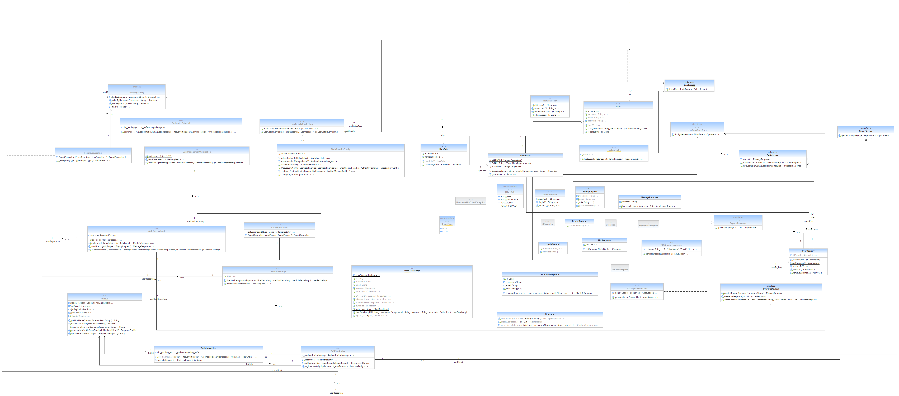

# Software Developed
A user management system to manage and store a list of users in a system. We have also developed a report generator that exports the list of users into different file formats such as pdf and xlsx.

## Contributions 

| Name           | %  |
|----------------|:--:|
| Amanjot Singh  | 33 |
| Daniel Khadivi | 33 |
| Kayla Manahan  | 33 |
 

# Objectives
Our aim was to make the code reusable by strategically applying design patterns. 

# Solution Description & Benefits
Our system implements a variety of patterns to assist with making the code more extensible. 

## Composite Pattern 
The [User](/src/main/java/ca/unb/usermanagement/model/User.java) class implements the Composite Pattern because it was the most effective way to create the role-based access hierarchy. 

The [User Roles](/src/main/java/ca/unb/usermanagement/model/EUserRole.java) in order from least to most access: 
* ROLE_USER
* ROLE_MODERATOR
* ROLE_ADMIN
* ROLE_SUPERUSER

## Singleton Pattern 
The [SuperUser](/src/main/java/ca/unb/usermanagement/model/SuperUser.java) and [UserRegistry](/src/main/java/ca/unb/usermanagement/model/UserRegistry.java) classes implement the singleton pattern because we want to ensure only one instance of each exist. The SuperUser should have all access rights to the system, but we needed to ensure only one SuperUser existed per UserRegistry. 

The benefit of implementing the Singleton pattern in these classes is having stricter control over the global access to the Object instance. 

## Strategy Pattern 
The [ReportGenerator](/src/main/java/ca/unb/usermanagement/service/report/ReportGenerator.java) class implements the Strategy Pattern which allows for flexibility in the [Type of Report](/src/main/java/ca/unb/usermanagement/service/report/ReportType.java) that is generated. 

Currently the system supports the following types of reports:
* [PDF](/src/main/java/ca/unb/usermanagement/service/report/PDFReportGenerator.java)
* [XLSX](/src/main/java/ca/unb/usermanagement/service/report/XLSXReportGenerator.java)

Having the Report generation structured in this way allows for more formats to be added with ease.

## Factory Method Pattern
The [Response](/src/main/java/ca/unb/usermanagement/payload/response/Response.java) class implements the Factory method because it can not anticipate which Response Type it will need to create. 

By using the factory method pattern:  
* The subclasses decide which class to instantiate.
* Localized knowledge of delegate helper subclass. 

Current response types:
* [List](/src/main/java/ca/unb/usermanagement/payload/response/ListResponse.java)
* [Message](/src/main/java/ca/unb/usermanagement/payload/response/MessageResponse.java)
* [UserInfo](/src/main/java/ca/unb/usermanagement/payload/response/UserInfoResponse.java)

Similar to the benefits for the Report generation, the factory methods makes it very simple to add more response types depending on the needs of the system in the future. 

# UML Diagram 



# API Specification

## Auth API

[Auth API](src\main\java\ca\unb\usermanagement\service\auth\AuthService.java)

* `POST /api/auth/login`
<br> Description: Authenticates a user
<br> Request body ```{ "username": "admin",
    "password": "password"}```
<br> Response example: ```{{
    "id": 1,
    "username": "admin",
    "email": "admin@test.com",
    "roles": [
        "ROLE_MODERATOR",
        "ROLE_ADMIN",
        "ROLE_USER"
    ]
}}```

* `POST /api/auth/signup`
<br> Description: Creates a new user with specified roles
<br> Request body ```{ "username": "admin",
    "email": "admin@test.com",
    "password": "password",
    "role": ["admin", "mod", "user"]}```
<br> Response example: ```{"message": "User registered successfully!"}```

* `POST /api/auth/signout`
<br> Description: Logs out a user
<br> Response example: ```{"message": "Logout success!"}```

## Test API

* `GET /api/test/all`
<br> Description: Tests the content available to all users
<br> Response example: ```Public Content.```

* `GET /api/test/user`
<br> Description: Tests the content available to users with 'user' role
<br> Response example: ```User Content.```

* `GET /api/test/mod`
<br> Description: Tests the content available to users with 'mod' role
<br> Response example: ```Moderator Board.```

* `GET /api/test/admin`
<br> Description: Tests the content available to users with 'admin' role
<br> Response example: ```Admin Board.```

## Report API

[Report API](src\main\java\ca\unb\usermanagement\service\report\ReportService.java)

* `GET /api/report/users?type=XLSX`
  <br> Description: returns report of the users (usernames, emails, roles) in the format of Excel file (.xlsx)

* `GET /api/report/users?type=PDF`
  <br> Description: returns report of the users (usernames, emails, roles) in the format of PDF file (.pdf)

## User API

[User API](src\main\java\ca\unb\usermanagement\service\user\UserService.java)

* `DELETE /api/user/delete`
  <br> Description: deletes the selected user if it exists

* `GET /api/user/`
  <br> Description: returns list of all users (usernames, emails, roles)

# Where to start
The [Help](../HELP.md) file is the best place to begin. It contains the localhost webpages necessary for reviewing our project.